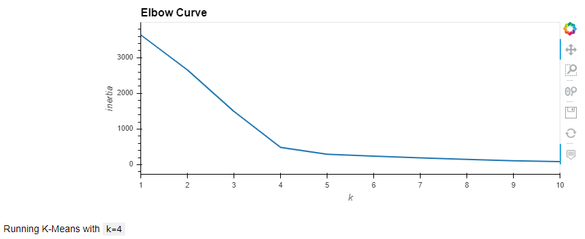

# Cryptocurrencies
UT Data Analytics &amp; Visualization:  Unsupervised Machine Learning

Purpose of this module assignment was to utilize Python in Jupyter Notebooks with following resources:
``` python
import pandas as pd
import hvplot.pandas
from path import Path
import plotly.express as px
from sklearn.preprocessing import StandardScaler, MinMaxScaler
from sklearn.decomposition import PCA
from sklearn.cluster import KMeans
```

Using these resources, data set provided from API to [https://www.cryptocompare.com/](https://www.cryptocompare.com/) was imported, cleaned, and analyzed using principles of:
* [Principal Component Analysis (PCA)](https://en.wikipedia.org/wiki/Principal_component_analysis)
* [K-Means](https://en.wikipedia.org/wiki/K-means_clustering)
* [Clustering](https://en.wikipedia.org/wiki/Cluster_analysis)
* [Elbow Curve](https://en.wikipedia.org/wiki/Elbow_method_(clustering))

Given data set is 1253 rows

Plot results produced:

Elbow (k=4)


3D PCA


x="TotalCoinsMined" and y="TotalCoinSupply" Scatter

